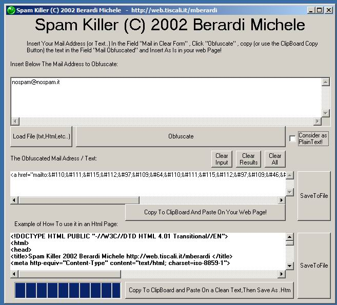

<div align="center">

## Spam Killer , Obfuscate your Mail Address or Text and get rid the spam bot from web pages\!\(UPGRADE\)


</div>

### Description

This program use a simple trick for obfuscate the mail address or

plain text from the avid eyes of the spam bot , that navigate

the web throught the research of mail address and than send

the resul to spammers ...

We can obfuscate our mail changing the reppresentation fo

the plaint text using charcodes.. simple, html browser

understand our directive and show the correct text

when an user open our page, simple.
 
### More Info
 


<span>             |<span>
---                |---
**Submitted On**   |2002-09-11 14:06:04
**By**             |[michele berardi](https://github.com/Planet-Source-Code/PSCIndex/blob/master/ByAuthor/michele-berardi.md)
**Level**          |Intermediate
**User Rating**    |4.5 (36 globes from 8 users)
**Compatibility**  |VB 3\.0, VB 4\.0 \(16\-bit\), VB 4\.0 \(32\-bit\), VB 5\.0, VB 6\.0
**Category**       |[Complete Applications](https://github.com/Planet-Source-Code/PSCIndex/blob/master/ByCategory/complete-applications__1-27.md)
**World**          |[Visual Basic](https://github.com/Planet-Source-Code/PSCIndex/blob/master/ByWorld/visual-basic.md)
**Archive File**   |[Spam\_Kille1294999112002\.zip](https://github.com/Planet-Source-Code/michele-berardi-spam-killer-obfuscate-your-mail-address-or-text-and-get-rid-the-spam-bot-f__1-38851/archive/master.zip)


### Source Code

```
/*
C version of the base plain-html obfuscator!
      (C) 2002 Michele Berardi
      http://web.tiscali.it/mberardi
*/
#include <stdio.h>
#include <string.h>
int i;
char *emailaddr = "nospam@nospam.it";
void main()
{
for (i=0;i<strlen(emailaddr);i++){printf ("&#%d;",(short)emailaddr[i]);}
}
```

